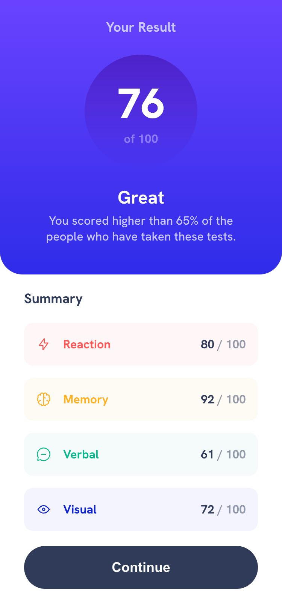
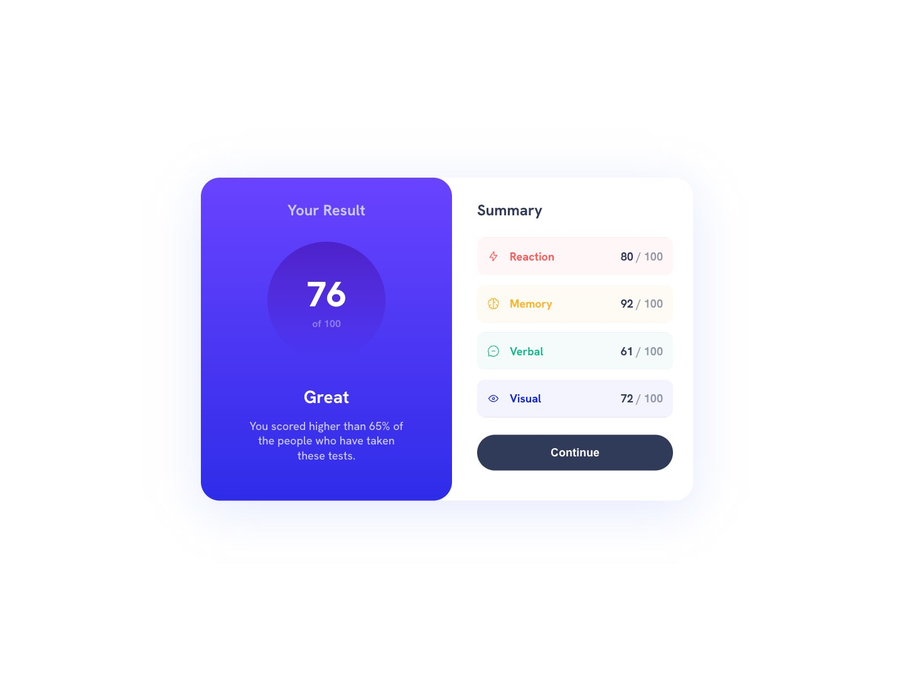

# Frontend Mentor - Results summary component solution

This is Max Ruuen's solution to the [Results summary component challenge on Frontend Mentor](https://www.frontendmentor.io/challenges/results-summary-component-CE_K6s0maV). Frontend Mentor challenges help you improve your coding skills by building realistic projects.

## Table of contents

- [Overview](#overview)
  - [The challenge](#the-challenge)
  - [Screenshot](#screenshot)
  - [Links](#links)
- [My process](#my-process)
  - [Built with](#built-with)
  - [What I learned](#what-i-learned)
- [Author](#author)

## Overview

### The challenge

Users should be able to:

- View the optimal layout for the interface depending on their device's screen size
- See hover and focus states for all interactive elements on the page

### Screenshot

#### Mobile

#### Desktop

### Links

- Solution URL: [Frontendmentor](https://www.frontendmentor.io/solutions/results-summary-component-with-react-scss-and-bem-DeQs6LD5aI)
- Live Site URL: [Netlify](https://rd-challenge-result-summary.netlify.app/)

## My process

### Built with

- React
- SCSS
- Flex & Grid
- BEM
- Mobile-first workflow

### What I learned

This is my first challenge in React after doing a few beginner courses and I'm really enjoying the experience of putting together small apps using React and thinking in components. I have done a lot with state and a little bit with useEffect so my usage might not be best practice here, however I am currently doing courses which are getting into more intermediate & advanced topics.

I tried to style the components with their own individual .scss files but it was a nightmare when trying to use global SCSS variables. Will revisit this in future as I haven't started journeying into best ways of styling React components.

## Author

- Frontend Mentor - [@ruuendigital](https://www.frontendmentor.io/profile/ruuendigital)
- Twitter - [@maxruuen](https://www.twitter.com/maxruuen)
